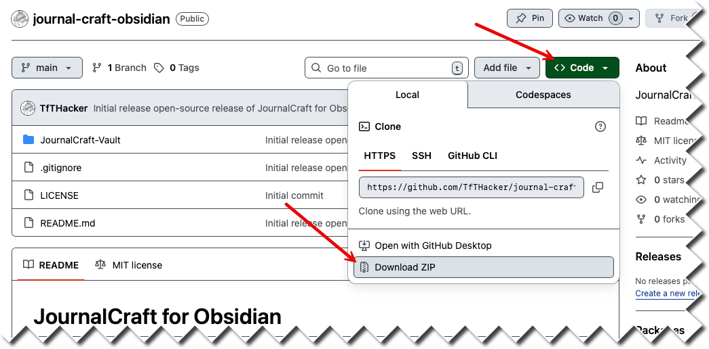

# JournalCraft for Obsidian

Learn more about JournalCraft at https://tfthacker.com/jco. This tool was created by [TfT Hacker](https://tfthacker.com) and has now been open-sourced in order for the Obsidian community to continue to use this learning tool and expand it.

# Using this learning vault
You need to download this entire repositiory to your local machine. You can download by clicking on the Code button, then "Download ZIP" as show in the image below.

Once the ZIP file is downloaded, extract it to your desired location. Then, open Obsidian and using the Manage Vault option, select "Open folder as vault" and navigate to the location where you extracted the ZIP file.

Select the folder named **JournalCraft-Vault**.

# Follow TfT Hacker
Also, follow TfTHacker at [x.com/@TfTHacker](https://x.com/@TfTHacker) for updates.